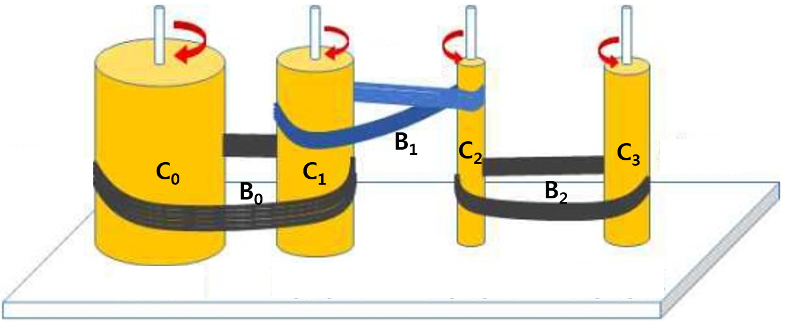

# Problem Set


[](https://colab.research.google.com/github/SuminHan/book-cs2/blob/main/notebooks/kor/lecture07.ipynb)

### 준비: `Point` class

문제 1과 문제 3은 아래의 `Point` class를 사용한다. **문제를 풀기 전에
이 셀을 먼저 실행하자.** (Colab은 런타임이 재시작되면 정의가 사라지므로,
재시작 후에도 이 셀부터 다시 실행해야 한다.)

각 함수 위의 주석은 함수의 종류를 나타낸다:
- **modifier**: `self`(또는 인자로 받은 객체)의 상태를 변경하는 함수
- **pure function**: 어떤 객체의 상태도 변경하지 않고 값을 계산해서
  return만 하는 함수

`add`(pure function)와 `add_as_modifier`(modifier)는 같은 덧셈을 두 방식으로
구현한 것이다. 아래 `point_main()`의 출력을 보고 두 함수의 차이를 확인해보자.

```python
class Point:
    # modifier
    def __init__(self, px, py):
        self.x = px
        self.y = py

    # pure function
    def __str__(self):
        return "(" + str(self.x) + ',' + str(self.y) + ")"

    # pure function
    def getX(self):
        return self.x

    # pure function
    def getY(self):
        return self.y

    # modifier
    def setX(self, v):
        self.x = v

    # modifier
    def setY(self, v):
        self.y = v

    # pure function
    def distance(self, p):
        dx = self.x - p.x
        dy = self.y - p.y
        return (dx*dx + dy*dy)**0.5

    # pure function
    def add(self, p):
        x = self.x + p.x
        y = self.y + p.y
        return Point(x, y)

    # modifier version of the add function
    def add_as_modifier(self, p):
        self.x += p.x
        self.y += p.y


def point_main():
    p1 = Point(1, 2)
    p2 = Point(4, 6)
    print(p1, p2)   # (1,2) (4,6)

    print(p1.distance(p2))  # 5.0
    print(p2.distance(p1))  # 5.0

    p3 = p1.add(p2)
    print(p3)  # (5,8)
    print(p1)  # (1,2)

    p4 = p1.add_as_modifier(p2)
    print(p4)  # None
    print(p1)  # (5,8)

    p1.setX(7)
    print(p1)          # (7,8)
    print(p1.getX())   # 7
    print(p1.setX(9))  # None

point_main()
```

### 필수 문제

### 문제 1

원을 나타내는 객체 타입(class) `Circle`과, `Circle`에 대해 동작하는 함수들을
작성하라.

1. `Circle` class의 객체를 생성하는 함수 `__init__` (**modifier**)을 작성하라:
   - 입력 파라미터: `self`, `Point` 객체 `c`, 정수 `r`
   - 동작: 상태 변수 `center`(원의 중심)와 `radius`(반지름)를 만들고, 각각
     `c`와 `r`로 초기화
   - 리턴값: 없음
2. `print` 명령에 사용될 문자열을 리턴하는 함수 `__str__` (**pure
   function**)을 작성하라:
   - 입력 파라미터: `self`
   - 리턴값: `"(center,radius)"` 형식의 문자열, 예: `"((0,1) , 5)"`
3. 함수 `area` (**pure function**)를 작성하라:
   - 입력 파라미터: `self`
   - 리턴값: `self`의 넓이 (\\(\pi\\)는 `math.pi`를 사용)
4. 함수 `getRadius` (**pure function**)를 작성하라:
   - 입력 파라미터: `self`
   - 리턴값: `self`의 반지름
5. 함수 `getCenter` (**pure function**)를 작성하라:
   - 입력 파라미터: `self`
   - 리턴값: `self`의 중심 (`Point` 객체)
6. 함수 `setRadius` (**modifier**)를 작성하라:
   - 입력 파라미터: `self`와 정수 `r`
   - 동작: `self`의 반지름을 `r`로 변경
   - 리턴값: 없음
7. 함수 `moveTo` (**modifier**)를 작성하라:
   - 입력 파라미터: `self`와 두 정수 `x, y`
   - 동작: `self`의 중심을 `Point(x,y)`로 이동
   - 리턴값: 없음
8. 함수 `move` (**modifier**)를 작성하라:
   - 입력 파라미터: `self`와 두 정수 `dx, dy`
   - 동작: `self`의 중심을 `(dx,dy)`만큼 이동
     - 원 중심의 x/y 좌표를 각각 `dx, dy`만큼 이동
   - 리턴값: 없음

*템플릿의 `pass`는 함수 본문이 비어 있으면 문법 오류가 나기 때문에 넣어둔
것이다. 코드를 작성한 뒤 지우면 된다.*

```python
import math

class Circle:
  # modifier
  def __init__(self, c, r):
    pass  # remove it after completing your code
    # ADD ADDITIONAL CODE HERE!

  # pure function
  def __str__(self):
    pass  # remove it after completing your code
    # ADD ADDITIONAL CODE HERE!

  # pure function
  def area(self):
    pass  # remove it after completing your code
    # ADD ADDITIONAL CODE HERE!

  # pure function
  def getRadius(self):
    pass  # remove it after completing your code
    # ADD ADDITIONAL CODE HERE!

  # pure function
  def getCenter(self):
    pass  # remove it after completing your code
    # ADD ADDITIONAL CODE HERE!

  # modifier
  def setRadius(self, v):
    pass  # remove it after completing your code
    # ADD ADDITIONAL CODE HERE!

  # modifier
  def moveTo(self, x, y):
    pass  # remove it after completing your code
    # ADD ADDITIONAL CODE HERE!

  # modifier
  def move(self, dx, dy):
    pass  # remove it after completing your code
    # ADD ADDITIONAL CODE HERE!


def test():
    p0 = Point(0, 0)
    c1 = Circle(p0, 3)
    print(c1)              # ((0,0) , 3)
    print(c1.area())       # 28.274333882308138
    print(c1.getRadius())  # 3
    print(c1.getCenter())  # (0,0)

    c1.setRadius(5)
    print(c1)              # ((0,0) , 5)
    print(c1.area())       # 78.53981633974483

    c1.moveTo(3, 4)
    print(c1)              # ((3,4) , 5)

    c1.move(1, 1)
    print(c1)              # ((4,5) , 5)

test()
```

### 문제 2

유리수(rational number)는 두 정수의 비로 나타낼 수 있는 수이다. 예를 들어
`2/3`은 유리수인데,
- `2`는 **분자**(numerator)이고
- `3`은 **분모**(denominator)이다.
  - `7`은 분모가 암묵적으로 `1`인 유리수로 간주한다.

이 문제에서는 유리수를 나타내는 객체 타입(class) `Rational`과, `Rational`
class에 대해 동작하는 함수들을 작성한다.

1. `Rational` class의 객체를 생성하는 함수 `__init__` (**modifier**)을
   작성하라:
   - 입력 파라미터: `self`와 두 정수 `n`, `d`
   - 동작: 상태 변수 `numerator`(분자)와 `denominator`(분모)를 만들고, 각각
     `n`과 `d`로 초기화
   - 리턴값: 없음
2. `print` 명령에 사용될 문자열을 리턴하는 함수 `__str__` (**pure
   function**)을 작성하라:
   - 입력 파라미터: `self`
   - 리턴값: `"7/24"` 형식의 문자열
3. 함수 `toFloat` (**pure function**)를 작성하라:
   - 입력 파라미터: `self`
   - 리턴값: `self`의 `float` 값 (예: `0.29166666`)
4. 함수 `negate` (**modifier**)를 작성하라:
   - 입력 파라미터: `self`
   - 동작: `self`의 부호를 반대로 바꿈
     - hint: 분자의 부호를 바꾸면 된다
   - 리턴값: 없음
5. 함수 `invert` (**modifier**)를 작성하라:
   - 입력 파라미터: `self`
   - 동작: `self`를 역수로 바꿈
     - hint: 분자와 분모를 서로 바꾸면 된다
   - 리턴값: 없음
6. 함수 `reduce` (**modifier**)를 작성하라:
   - 입력 파라미터: `self`
   - 동작: `self`를 기약분수로 만듦 (최대공약수로 약분)
     - hint: 주어진 함수 `gcd`를 이용
   - 리턴값: 없음
7. 함수 `add` (**pure function**)를 작성하라:
   - 입력 파라미터: `self`와 `r` (둘 다 `Rational` 객체)
   - 리턴값: `self`와 `r`의 합을 나타내는 **새로운** `Rational` 객체
     (기약분수 형태)
     - 반드시 덧셈 결과를 최대공약수로 약분 (`reduce` 함수를 이용)
     - **Pure function** 형태로 만들어야 하므로 `self`와 `r`은
       변경하면 안됨
8. 함수 `mul` (**pure function**)을 작성하라:
   - 입력 파라미터: `self`와 `r` (둘 다 `Rational` 객체)
   - 리턴값: `self`와 `r`의 곱을 나타내는 **새로운** `Rational` 객체
     (기약분수 형태)
     - 반드시 곱셈 결과를 최대공약수로 약분 (`reduce` 함수를 이용)
     - **Pure function** 형태로 만들어야 하므로 `self`와 `r`은
       변경하면 안됨

```python
def gcd(a, b):
    if b > a:
        a, b = b, a
    while b > 0:
        a, b = b, a%b
    return a

class Rational:
  # modifier
  def __init__(self, n, d):
    pass  # remove it after completing your code
    # ADD ADDITIONAL CODE HERE!

  # pure function
  def __str__(self):
    pass  # remove it after completing your code
    # ADD ADDITIONAL CODE HERE!

  # pure function
  def toFloat(self):
    pass  # remove it after completing your code
    # ADD ADDITIONAL CODE HERE!

  # modifier
  def negate(self):
    pass  # remove it after completing your code
    # ADD ADDITIONAL CODE HERE!

  # modifier
  def invert(self):
    pass  # remove it after completing your code
    # ADD ADDITIONAL CODE HERE!

  # modifier
  def reduce(self):
    pass  # remove it after completing your code
    # ADD ADDITIONAL CODE HERE!

  # pure function
  def add(self, r):
    pass  # remove it after completing your code
    # ADD ADDITIONAL CODE HERE!

  # pure function
  def mul(self, r):
    pass  # remove it after completing your code
    # ADD ADDITIONAL CODE HERE!


def test():
    r1 = Rational(12, 16)
    r2 = Rational(9, 6)
    print(r1, r2)  # 12/16 9/6

    r1.reduce()
    r2.reduce()
    print(r1, r2)  # 3/4 3/2

    r1.negate()
    print(r1)  # -3/4
    r1.negate()
    print(r1)  # 3/4

    r1.invert()
    print(r1)  # 4/3

    r3 = r1.add(r2)
    r4 = r1.mul(r2)
    print(r3)  # 17/6
    print(r4)  # 2/1

    print(r3.toFloat())  # 2.8333333333333335
    print(r4.toFloat())  # 2.0

test()
```

### 선택 문제 (문제 3~5)

필수 문제와 달리 제출/검사 대상은 아니지만, 큰 도움이 되므로 시간이 남으면
모두 시도해보는 것을 권합니다 (대부분 기출문제입니다).

*문제 4와 5는 각 문제의 코드 셀에 별도의 `Rational` class가 주어진다.
문제 2에서 직접 만든 `Rational`이 아니라 그 셀의 class를 사용해야 하므로,
문제 4/5는 해당 셀 전체를 실행하자.*

### 문제 3

직사각형을 나타내는 class `Rectangle`을 작성하라:
- 각 `Rectangle` 객체는 두 개의 `Point` 객체 `point1`과 `point2`로
  이루어진다. (생성되는 직사각형은 가로, 세로가 각각 x축, y축에 평행하고,
  `point1`과 `point2`는 직사각형의 대각에 위치하는 두 꼭짓점이라 가정한다.)
  - `Point` class는 이미 정의되어 있다 (맨 위의 준비 셀).
- `Rectangle` class의 각 함수의 본문을 채워라.
  - 각 함수가 해야 할 일은 주석으로 주어져 있다.
- `min(a,b)`와 `max(a,b)`를 사용하여 두 수 중 최대/최소값을 구하면 된다.

```python
class Rectangle:
  def __init__(self, point1, point2):
    # 두 인스턴스 변수 설정 --> 이미 완성되어 있음
    # 모든 파라미터는 올바르게 주어진다고 가정한다.
    # (point1, point2는 항상 직사각형을 생성할 수 있는 대각에 있는
    #  두 꼭짓점으로 주어진다고 가정한다.)
    self.point1 = point1
    self.point2 = point2

  def __str__(self):
    # "[(1,1),(4,5)]" 형식의 문자열을 만든다
    # Point class의 함수를 이용할 것
    pass  # remove it after completing your code
    # ADD ADDITIONAL CODE HERE!

  def get_min_x(self):
    # 직사각형의 점들 중 가장 작은 x 값을 리턴
    pass  # remove it after completing your code
    # ADD ADDITIONAL CODE HERE!

  def get_min_y(self):
    # 직사각형의 점들 중 가장 작은 y 값을 리턴
    pass  # remove it after completing your code
    # ADD ADDITIONAL CODE HERE!

  def get_max_x(self):
    # 직사각형의 점들 중 가장 큰 x 값을 리턴
    pass  # remove it after completing your code
    # ADD ADDITIONAL CODE HERE!

  def get_max_y(self):
    # 직사각형의 점들 중 가장 큰 y 값을 리턴
    pass  # remove it after completing your code
    # ADD ADDITIONAL CODE HERE!

  def contains(self, point3):
    # 직사각형이 point3를 포함하면 True, 아니면 False를 리턴
    # point3가 직사각형의 변 위에 있으면 True를 리턴
    pass  # remove it after completing your code
    # ADD ADDITIONAL CODE HERE!

  def area(self):
    # 직사각형의 넓이를 리턴
    pass  # remove it after completing your code
    # ADD ADDITIONAL CODE HERE!

  def isEqual(self, other):
    # 직사각형이 other와 같으면 True를 리턴
    # r1 = Rectangle(Point(5,0), Point(2,3))
    # r2 = Rectangle(Point(2,0), Point(5,3))
    # r1.isEqual(r2)는 True를 리턴
    # 즉 두 사각형이 같은 좌표 상에 위치하면 True를 return 한다.
    pass  # remove it after completing your code
    # ADD ADDITIONAL CODE HERE!


def test():
    p1, p2, p3, p4 = Point(1,1), Point(4,5), Point(5,0), Point(2,3)
    p5, p6, p7, p8 = Point(4,3), Point(0,0), Point(2,0), Point(5,3)

    r1, r2, r3 = Rectangle(p1,p2), Rectangle(p3,p4), Rectangle(p7,p8)

    print(r1, r2, r3)       # [(1,1),(4,5)] [(5,0),(2,3)] [(2,0),(5,3)]
    print(r1.area())        # 12
    print(r2.area())        # 9
    print(r3.area())        # 9
    print(r1.contains(p4))  # True
    print(r1.contains(p5))  # True
    print(r2.contains(p6))  # False
    print(r1.isEqual(r3))   # False
    print(r2.isEqual(r3))   # True
    print(r1.isEqual(r1))   # True

test()
```

### 문제 4



위와 같이 벨트 \\(B_0, B_1, \ldots, B_{n-2}\\)들로 연결된 원기둥
\\(C_0, C_1, \ldots, C_{n-1}\\)들을 고려하자 (\\(n \ge 2\\)):
- 원기둥 \\(C_0, C_1, \ldots, C_{n-1}\\)는 왼쪽부터 오른쪽으로 차례대로
  배치되어 있는데, 중심이 축으로 고정되어 자유롭게 회전될 수 있다.
- 각 벨트 \\(B_i\\)는 원기둥 \\(C_i\\)와 \\(C_{i+1}\\)을 연결한다.
- 한쪽 원기둥이 회전하게 되면 벨트로 연결된 다른 원기둥도 회전하게 된다.
- 두 원기둥의 반지름의 차이에 따라 두 원기둥의 회전수가 서로 다를 수
  있다.
- 벨트가 **꼬이지 않고 0자 형태**로 연결될 수 있고, **8자 형태로 한번
  꼬여서** 연결될 수도 있다. 이 형태에 따라 두 원기둥의 회전방향은 같을
  수도 있고 반대 방향일 수도 있다.

위 그림의 예에서 \\(C_0, C_1, C_2, C_3\\)의 반지름이 각각 `10, 5, 1, 2`라고
가정하자:
- \\(C_0\\)을 시계방향으로 1회전시키면 \\(C_1\\)은 시계방향으로 `10/5 = 2`회전하게
  된다.
- \\(C_1\\)을 시계방향으로 1회전시키면 \\(C_2\\)는 반시계방향으로 `5/1 = 5`회전하게
  된다.
  - \\(B_1\\)이 8자 형태로 꼬여서 \\(C_1\\)과 \\(C_2\\)를 연결하므로 두 원기둥의
    회전방향은 서로 반대
- \\(C_2\\)를 시계방향으로 1회전시키면 \\(C_3\\)는 시계방향으로 `1/2`회전하게 된다.

이 문제에서는 \\(C_0\\)을 시계방향으로 1회전시켰을 때, $C_1, C_2, \ldots,
C_{n-1}$의 회전수의 총합을 계산하는 것을 목표로 한다. 다음과 같이 정의된
함수 `belt`를 완성하라:
- 입력: 원기둥 \\(C_0, C_1, \ldots, C_{n-1}\\)의 반지름을 나타내는 정수
  리스트 `L`과 벨트 \\(B_0, B_1, \ldots, B_{n-2}\\)의 연결 형태를 나타내는
  정수 리스트 `M`
  - `L[i]`는 원기둥 \\(C_i\\)의 반지름을 나타냄
  - `M[i] = 1`: 벨트 \\(B_i\\)가 꼬이지 않고 0자 형태로 연결된 경우
  - `M[i] = -1`: 벨트 \\(B_i\\)가 한번 꼬여서 8자 형태로 연결된 경우
  - 위 예의 경우 `L = [10,5,1,2]`이고 `M = [1,-1,1]`
- 리턴값: \\(C_0\\)를 시계방향으로 1회전시켰을 때, $C_1, C_2, \ldots,
  C_{n-1}$의 회전수의 총합을 나타내는 `Rational` object
  - \\(C_i\\)가 반시계방향으로 회전하는 경우 회전수의 부호를 음으로 하고,
    시계방향으로 회전하면 양으로 한다. 위 예의 경우 \\(C_1, C_2, C_3\\)의
    회전 수는 각각 `2, -10, -5`이다.
  - 위 예의 경우 `2 - 10 - 5 = -13`을 나타내는 `Rational(-13,1)`을 리턴
    (`print`하면 `-13/1`)

*본 문제의 의도는 class/object를 제대로 사용할 수 있는 지를 평가하는
것으로, **아래 셀에 주어진 `Rational` class를 변경/추가없이 사용**하고,
반드시 `Rational` object를 return해야 하며 `float`나 임의로 정의한
object를 return하면 안된다.*

```python
def gcd(a, b):
    a, b = abs(a), abs(b)
    if b > a: a, b = b, a
    while b > 0: a, b = b, a%b
    return a

# Do not modify class Rational
# Do not add any new function inside class Rational
class Rational(object):
    def __init__(self, n, d):
        g = gcd(n, d)
        self.numer, self.denom = n//g, d//g
        if self.denom < 0:
            self.numer, self.denom = -self.numer, -self.denom

    def __str__(self):
        return str(self.numer) + "/" + str(self.denom)

    # modifier
    def negate(self):
        self.numer *= -1

    # modifier
    def invert(self):
        self.numer, self.denom = self.denom, self.numer

    # pure function
    def add(self, r):
        n = self.numer * r.denom + self.denom * r.numer
        m = self.denom * r.denom
        return Rational(n, m)

    # pure function
    def mul(self, r):
        n = self.numer * r.numer
        m = self.denom * r.denom
        return Rational(n, m)

##########################################################
def belt(L, M):
  assert len(M) == len(L)-1
  n = len(L)

  sum = Rational(0, 1)
  # ADD ADDITIONAL CODE HERE!


r1 = belt([10,5,1,2], [1,-1,1])
r2 = belt([90,165,60,15,180,195,105,75,150,45,210,30,120,135],
          [-1,1,1,-1,-1,-1,1,1,-1,1,1,1,1])
print(r1)  # -13/1
print(r2)  # -732437/60060
```

### 문제 5

6주차에 다루었던 Gaussian elimination(이 책의 Lecture 5 문제 1)을
사용하여 일차연립방정식의 해를 계산할 때, 해가 정수값일 경우에도
`1.9999..`나 `2.00001..`과 같이 정확하게 계산되지 않음을 경험했을 것이다.
특히, 7주차 3번 문제를 시도해봤다면 거대한 규모의 방정식을 다룰 때 오차가
매우 심하게 발생함을 경험했을 것이다.

이런 문제점이 야기되는 이유는
- Gaussian elimination을 수행하는 과정에서 나눗셈 연산이 적용되어 `float`
  값이 발생하는데,
- `float` 값에 대한 사칙연산은 오차가 있으며 연산을 여러 번 거치면서
  오차가 매우 큰 수준으로 누적되기 때문이다.

연립방정식의 계수가 정수로 주어진 경우 계산과정을 유리수에서 수행하여
오차없이 정확한 값을 계산할 수 있는데, Gaussian elimination에서 `float`
값으로 다루어지는 `a[i][j], b[i], x[i]`들을 8주차에 다루었던 `Rational`
object로 표현하고, 이들 값에 대한 연산들을 `Rational` class 내부에 정의된
함수들을 사용하여 수행함으로써 `a[i][j], b[i], x[i]`들을 `Rational`
object로 유지하고, 최종적으로 `x`도 `Rational` object의 리스트로 계산하여
리턴할 수 있고 이렇게 하면 오차가 발생하지 않는다. 예를 들어,
- Gaussian elimination을 수행하기 직전에 정수값인 `a[i][j]`와 `b[i]`들을
  `Rational` object로 바꿔주고 (템플릿 코드에 이미 구현되어 있음)
- `c = a[i][p]/a[p][p]`는 `c = a[i][p].div(a[p][p])`로 변경하고
- `a[p][p] == 0`은 `a[p][p].equal(Rational(0,1))`로 변경하는

등 `Rational` class 내부의 함수들을 이용하면 유리수에 대한 Gaussian
elimination을 간단히 구현할 수 있을 것이다.

다음과 같이 정의된 함수 `gaussian_rational`을 완성하라:
- 입력: 6주차 1번 문제와 같은 형태
  - `a[i][j]`와 `b[i]`는 정수로 주어지는데, 템플릿 코드에 주어진 함수의
    입구에서 이 값들을 바로 `Rational` object로 변경함
- 리턴값: 6주차 1번 문제와 같은 리스트 `x`를 계산하되 `float` 값 대신
  `Rational` object들로 이루어진 리스트
  - 6주차 1번 문제와 마찬가지로 연립방정식의 해가 없거나 해가 무한히 많이
    존재하면 `None`을 리턴한다.
  - 분모가 1인 `Rational`의 경우 `print`하면 정수처럼 출력되는데, 이는
    `__str__` 함수에서 그렇게 되도록 정의했기 때문이다.
  - 분모가 1이라고 해서 이를 `toInt` 함수를 사용하여 정수로 변환하면 안되고
    `Rational` object 그대로 놔둬야 한다. (`toInt` 함수는 이 문제가 아니고
    7주차 3번 문제에서 사용하기 위해 정의된 것이다.)

*8주차에 다룬 `Rational` class 내부의 함수들이 약간 바뀌고, 새로운
함수들이 여러개 추가되었는데, 이들의 의미를 정확히 이해하고 이용하는 것이
관건이다. 예를 들어, 4번 문제에서와 마찬가지로 두개의 `Rational` object
`r1`과 `r2`가 같은 값을 나타내는 지를 판단하기 위해 `r1 == r2`를 사용하면
의도와 다르게 작동하는데, `r1.equal(r2)`를 사용해야 한다. (자세한 이유와
이를 처리하는 더욱 세련된 방법을 알고 싶으면 상위 과목을 수강하면 된다.)*

아래 셀에 주어진 `Rational` class의 함수 목록 (class는 변경/추가 금지):

| 함수 | 종류 | 의미 |
|---|---|---|
| `Rational(n, d)` | 생성 | `n/d`를 만든다 (`d != 0`) |
| `__str__()` | pure | 분모가 1이면 `"5"`, 아니면 `"7/24"` 형태 |
| `toFloat()` | pure | `float` 값 |
| `negate()` | **pure** | 부호를 바꾼 **새** `Rational`을 return |
| `invert()` | **pure** | 역수인 **새** `Rational`을 return |
| `add(r)`, `sub(r)`, `mul(r)`, `div(r)` | pure | `self + r`, `self - r`, `self * r`, `self / r` |
| `absolute()` | pure | 절댓값 |
| `greaterThan(r)` | pure | `self > r`이면 `True` |
| `equal(r)` | pure | `self`와 `r`이 같은 값이면 `True` |
| `toInt()` | pure | 분모가 1일 때 정수로 변환 (이 문제에서는 사용 금지) |

*문제 2/4의 `negate`, `invert`는 modifier였지만 여기서는 pure
function이라는 점에 주의하자.*

```python
def gcd(a, b):
    if b > a:
        a, b = b, a
    while b > 0:
        a, b = b, a%b
    return a

# Do not modify class Rational
# Do not add any new function inside class Rational
class Rational(object):
    def __init__(self, n, d):
        assert d != 0
        if d > 0:
            self.numer = n
            self.denom = d
        else:
            self.numer = -n
            self.denom = -d
        g = gcd(abs(self.numer), self.denom)
        self.numer = self.numer//g
        self.denom = self.denom//g

    def __str__(self):
        if self.denom == 1:
            return str(self.numer)
        else:
            return str(self.numer) + "/" + str(self.denom)

    def toFloat(self):
        return float(self.numer) / self.denom

    def negate(self):  # pure function
        return Rational(-self.numer, self.denom)

    def invert(self):  # pure function
        return Rational(self.denom, self.numer)

    def add(self, r):
        return Rational(self.numer * r.denom + self.denom * r.numer, self.denom * r.denom)

    def mul(self, r):
        return Rational(self.numer * r.numer, self.denom * r.denom)

    #######
    def absolute(self):
        return Rational(abs(self.numer), self.denom)

    def greaterThan(self, r):  # >
        return self.numer * r.denom > r.numer * self.denom

    def equal(self, r):  # ==
        return self.numer * r.denom == r.numer * self.denom

    def sub(self, r):  # subtraction
        return Rational(self.numer * r.denom - self.denom * r.numer, self.denom * r.denom)

    def div(self, r):  # division
        return Rational(self.numer * r.denom, self.denom * r.numer)

    def toInt(self):
        assert self.denom == 1
        return self.numer

##################################################################
def gaussian_rational(a, b):
  assert len(a) == len(a[0]) == len(b)
  n = len(b)

  # convert integers to Rational objects (leave it as it is)
  for i in range(n):
    for j in range(n):
      if type(a[i][j]) == int:
        a[i][j] = Rational(a[i][j], 1)
    if type(b[i]) == int:
      b[i] = Rational(b[i], 1)

  # ADD ADDITIONAL CODE HERE!


############################################################
def test():
    a = [[0, 1, 1], [2, 4, -2], [0, 3, 15]]
    b = [4, 2, 36]
    X = gaussian_rational(a, b)
    for i in range(len(X)): print(X[i], end=" ")
    print()   # -1 2 2

    a = [[1, 0, 1, 4], [2, -1, 1, 7], [-2, 1, 0, -6], [1, 1, 1, 9]]
    b = [1, 2, 3, 4]
    X = gaussian_rational(a, b)
    for i in range(len(X)): print(X[i], end=" ")
    print()   # -44/5 -5 17/5 8/5

    a = [[0, 1, 1], [2, 4, -2], [2, 5, -1]]
    b = [4, 2, 36]
    X = gaussian_rational(a, b)
    print(X)  # None

test()
```

### 참고: 트랜스포머 코드

Keras 공식 예제 [Text classification with Transformer](https://keras.io/examples/nlp/text_classification_with_transformer/)의
코드를 그대로 가져온 것이다 (원저자 Apoorv Nandan, Apache License 2.0).
문제가 아니라 눈으로 훑어보는 참고용이다. 오늘 배운 `class`, `__init__`,
`self`가 실제 딥러닝 코드에서 어떻게 쓰이는지 보자.

```python
"""
Title: Text classification with Transformer
Author: [Apoorv Nandan](https://twitter.com/NandanApoorv)
Date created: 2020/05/10
Last modified: 2024/01/18
Description: Implement a Transformer block as a Keras layer and use it for text classification.
Accelerator: GPU
Converted to Keras 3 by: [Sitam Meur](https://github.com/sitamgithub-MSIT)
"""

"""
## Setup
"""

import keras
from keras import ops
from keras import layers

"""
## Implement a Transformer block as a layer
"""


class TransformerBlock(layers.Layer):
    def __init__(self, embed_dim, num_heads, ff_dim, rate=0.1):
        super().__init__()
        self.att = layers.MultiHeadAttention(num_heads=num_heads, key_dim=embed_dim)
        self.ffn = keras.Sequential(
            [
                layers.Dense(ff_dim, activation="relu"),
                layers.Dense(embed_dim),
            ]
        )
        self.layernorm1 = layers.LayerNormalization(epsilon=1e-6)
        self.layernorm2 = layers.LayerNormalization(epsilon=1e-6)
        self.dropout1 = layers.Dropout(rate)
        self.dropout2 = layers.Dropout(rate)

    def call(self, inputs):
        attn_output = self.att(inputs, inputs)
        attn_output = self.dropout1(attn_output)
        out1 = self.layernorm1(inputs + attn_output)
        ffn_output = self.ffn(out1)
        ffn_output = self.dropout2(ffn_output)
        return self.layernorm2(out1 + ffn_output)


"""
## Implement embedding layer

Two separate embedding layers, one for tokens, one for token index (positions).
"""


class TokenAndPositionEmbedding(layers.Layer):
    def __init__(self, maxlen, vocab_size, embed_dim):
        super().__init__()
        self.token_emb = layers.Embedding(input_dim=vocab_size, output_dim=embed_dim)
        self.pos_emb = layers.Embedding(input_dim=maxlen, output_dim=embed_dim)

    def call(self, x):
        maxlen = ops.shape(x)[-1]
        positions = ops.arange(start=0, stop=maxlen, step=1)
        positions = self.pos_emb(positions)
        x = self.token_emb(x)
        return x + positions


"""
## Download and prepare dataset
"""

vocab_size = 20000  # Only consider the top 20k words
maxlen = 200  # Only consider the first 200 words of each movie review
(x_train, y_train), (x_val, y_val) = keras.datasets.imdb.load_data(num_words=vocab_size)
print(len(x_train), "Training sequences")
print(len(x_val), "Validation sequences")
x_train = keras.utils.pad_sequences(x_train, maxlen=maxlen)
x_val = keras.utils.pad_sequences(x_val, maxlen=maxlen)

"""
## Create classifier model using transformer layer

Transformer layer outputs one vector for each time step of our input sequence.
Here, we take the mean across all time steps and
use a feed forward network on top of it to classify text.
"""


embed_dim = 32  # Embedding size for each token
num_heads = 2  # Number of attention heads
ff_dim = 32  # Hidden layer size in feed forward network inside transformer

inputs = layers.Input(shape=(maxlen,))
embedding_layer = TokenAndPositionEmbedding(maxlen, vocab_size, embed_dim)
x = embedding_layer(inputs)
transformer_block = TransformerBlock(embed_dim, num_heads, ff_dim)
x = transformer_block(x)
x = layers.GlobalAveragePooling1D()(x)
x = layers.Dropout(0.1)(x)
x = layers.Dense(20, activation="relu")(x)
x = layers.Dropout(0.1)(x)
outputs = layers.Dense(2, activation="softmax")(x)

model = keras.Model(inputs=inputs, outputs=outputs)


"""
## Train and Evaluate
"""

model.compile(
    optimizer="adam", loss="sparse_categorical_crossentropy", metrics=["accuracy"]
)
history = model.fit(
    x_train, y_train, batch_size=32, epochs=2, validation_data=(x_val, y_val)
)

"""
## Relevant Chapters from Deep Learning with Python
- [Chapter 14: Text classification](https://deeplearningwithpython.io/chapters/chapter14_text-classification)
- [Chapter 15: Language models and the Transformer](https://deeplearningwithpython.io/chapters/chapter15_language-models-and-the-transformer)
"""
```
